# Hard Hat Detection — YOLOv8 目标检测全流程项目


## 1. 任务与难点

- 数据集：[Hard Hat Detection](https://www.kaggle.com/datasets/andrewmvd/hard-hat-detection)，
  5000 张工地场景图片，PASCAL VOC 标注，3 类：helmet / head / person。
- 难点：① 目标小（工人通常占画面很小比例）；② 类别不均衡（helmet 实例远多于 head）；
  ③ `person` 类存在已知标注不全问题（社区多处提及）；④ helmet 与 head 语义相邻，天然混淆对。

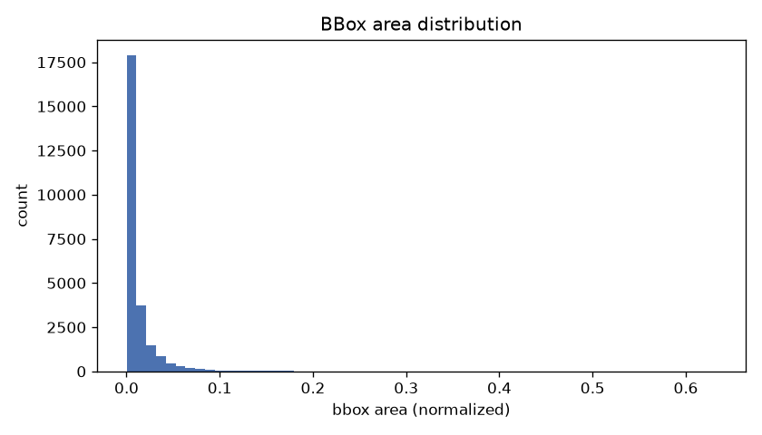

*图 1：全部 25502 个标注框的面积分布——绝大多数框挤在最左侧，小目标主导。*

## 2. 我做了什么

1. 数据工程：VOC XML → YOLO 格式转换（固定类别映射 helmet=0/head=1/person=2）、
   seed=42 固定 80/10/10 划分、五项数据体检 + 50 张标注叠加人工抽检。
2. 基线对齐：YOLOv8n @640px，50 epoch，cos 学习率衰减，
   optimizer=auto（实际选中 AdamW，lr 峰值 1.43e-3 → 末轮 1.57e-5）。
3. 控制变量消融（3 组，每次只变一个变量，每组先写明"要回答什么问题"）：
   - A. 关闭 mosaic 增强 → mosaic 是不是在起正则作用？
   - B. lr0 减半（0.001429→0.000714，显式 AdamW 保持单变量）→ 学习率敏感性？
   - C. 输入分辨率 640→960 → person 崩是不是因为小目标看不清？
4. 测试集终评（500 张，全程未参与调参）+ 人工错误分析 + CNN 特征图可视化
   + 100 epoch 加长验证跑（检验"欠拟合"猜测，结论：被推翻，见第 4 节）。

## 3. 结果总表

验证集（500 张，固定 seed=42 划分）结果，全部跑满 50 epoch：

| 实验 | 改动 | best_epoch | mAP50 | mAP50-95 | train/val gap | 备注 |
|---|---|---|---|---|---|---|
| base | — | 47 | 0.6480 | 0.4248 | 0.063 | |
| ablation_no_mosaic | mosaic=0 | 49 | 0.6427 | 0.4211 | 0.089 | mAP 微降 + gap 拉大 → mosaic 起正则作用 |
| ablation_lr_half | lr0 减半 | 47 | 0.6449 | 0.4244 | 0.102 | mAP 几乎不变 → lr ±50% 稳健 |
| ablation_imgsz960 | 640→960 | 50 | 0.6439 | 0.4244 | 0.035 | 无收益且跑满 50 未收敛；person 仍崩 → 瓶颈在标注不在分辨率 |
| base_long100 | epochs 50→100 | 56 | 0.6461 | 0.4248 | 0.043 | 第 66 轮早停；成绩≈base → 50 epoch 已收敛，推翻"欠拟合"猜测（见第 4 节） |
| ~~ablation_lr5e3~~ | lr0=5e-3 | — | — | — | — | INVALID：optimizer=auto 静默忽略 lr0，结果与 base 逐位相同（失败记录 7） |

测试集终评（base best.pt，500 张，全程未参与调参）：

| mAP50 | mAP50-95 | Precision | Recall | helmet AP50 | head AP50 | person AP50 |
|---|---|---|---|---|---|---|
| 0.6233 | 0.4203 | 0.952 | 0.580 | 0.951 | 0.898 | 0.021 |

- val mAP50=0.6475 vs test 0.6233，差距 0.024：无划分泄漏，验证集结论可迁移到测试集。
- P=0.95 / R=0.58：模型风格保守——宁可漏检也不错检，瓶颈在召回。
- person AP50=0.021：该类实例少且标注不全（社区已知问题），这个数值反映的是
  标注质量问题，不代表模型对"人"的真实检测能力。

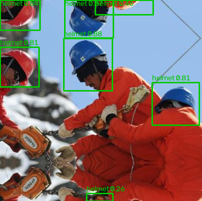

*图 2：best.pt 在测试集图片上的真实预测——红蓝安全帽全部框出（置信度 0.81~0.88），
底部一个模糊目标只给 0.26，模型会"拿不准"而不是瞎报。*

## 4. 过拟合诊断

（证据：`runs/analysis/<name>/loss_curves.png` + `train_vs_val_map.png` + `conclusion.txt`）

判定：**base 在 50 epoch 内无明显过拟合，且已收敛**（非欠拟合——经 100 epoch 加长实验推翻，见下）。

证据（base）：

1. val loss 全程未出现持续回升的拐点，mAP 平台期出现在 47 轮附近；
2. best.pt 上 train mAP50=0.7108 / val mAP50=0.6475，差距 0.063 < 0.10 经验阈值；
3. 检测任务训练集带增强，val loss 低于 train loss 属正常——判过拟合看走势分化，
   不看绝对高低。

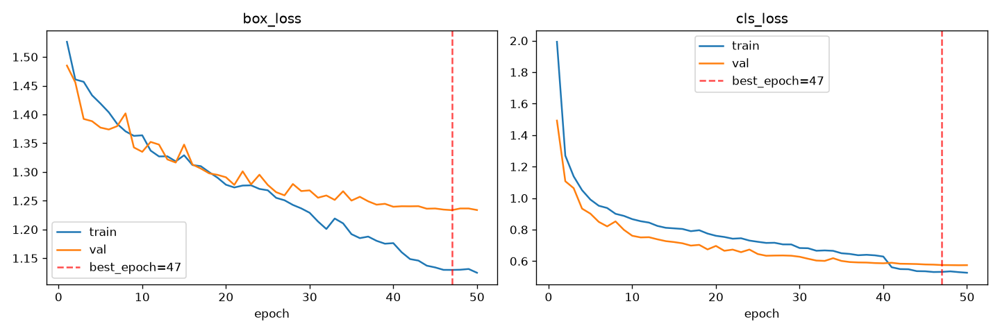

*图 3：base 的 box/cls loss 曲线，红虚线为 best_epoch=47——val 曲线无持续回升拐点。*

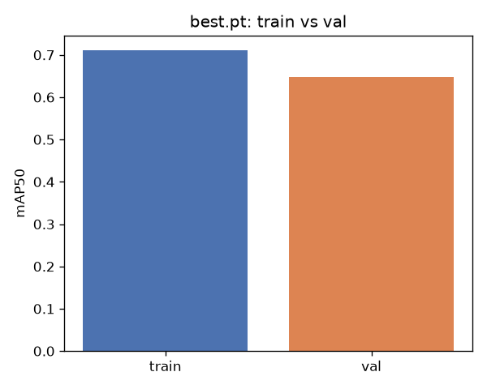

*图 4：best.pt 在 train 与 val 上的 mAP 对比，差距 0.063 在正常范围（≤0.10）。*

消融交叉验证：

- 关掉 mosaic 后 gap 从 0.063 拉大到 0.089 且 mAP 微降 → mosaic 确实在起正则作用，
  但 gap 仍未越线，说明 base 的正则水平"够用但不富余"；
- lr_half 的 gap=0.102 轻微越线，但 val mAP 未掉、val loss 无拐点 →
  解读为"拟合差异加大"而非病态过拟合（train mAP 涨、val 没受损）。

100 epoch 加长验证（假设被推翻的记录）：

- 假设：base best_epoch=47/50 贴近边界，疑似"没训够"（欠拟合受限）；
- 实验：同配置仅 epochs 50→100，patience=10 早停兜底；
- 结果：第 56 轮达峰后连续 10 轮无新高，第 66 轮触发早停；mAP50=0.6461
  （base 0.6480）、mAP50-95=0.4248 持平，train/val gap 反而缩小到 0.043；
- 结论：**50 epoch 已收敛，说明问题不是训练时长**。However：cosine 按 100 轮
  排程，早停时 lr 尚在 4e-4 未走完全部衰减，理论上完整收尾或能再挤一点；
  但 10 轮平台期 + gap 缩小已足以说明收益上限。
- 修订后的对策：剩余提升空间在数据侧（person 标注质量、copy-paste 增强、
  网抓杂质清洗）与模型容量，不在训练时长。

## 5. 学习率诊断

（证据：`runs/analysis/<name>/lr_schedule.png`）

- 调度形态：warmup 3 epoch → cosine 衰减，峰值 1.42e-3 → 末轮 1.57e-5，形态正常。

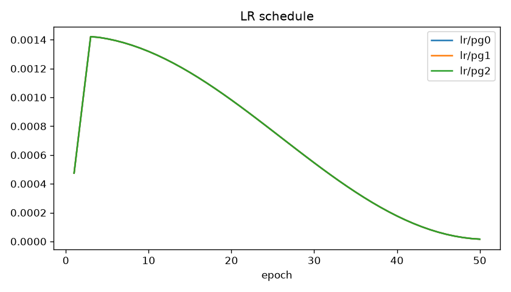

*图 5：lr 调度曲线——lr0 是一次性设定的超参数，训练中的每步 lr 由调度器按曲线自动算出。*
- 意外发现：optimizer=auto 实际选中 **AdamW(lr=0.001429, beta1=0.9)** 而非直觉上的 SGD，
  且会静默忽略手动传入的 lr0/momentum——消融 B 因此返工一次（失败记录第 7 条）。
- 对比：lr0 减半后 mAP50 仅 -0.0031、mAP50-95 仅 -0.0004 → 在 50 epoch 预算下，
  学习率 ±50% 不敏感，不是当前瓶颈。
- 最终选择：沿用 auto（AdamW, lr=0.001429）。理由：50 epoch 内收敛形态健康，
  且消融证明结果对其取值稳健。

## 6. 错误分析，兑，这里基本是手搓而不是ai

方法：base best.pt，conf=0.25，在验证集抽 60 张问题样本，
按 FP / FN / 错分类 / 定位误差 四类人工看图归类
（图片在 `runs/analysis/base/badcases/`，已按类别分文件夹）。

量化分布：**FP=63，FN=40，CLS=4，LOC=2**。

- FP 最多（约为 FN 的 1.6 倍）：与测试集 P=0.95 的"整体保守"并不矛盾——
  badcase 抽样专挑有错的图，0.95 是全集口径；两个口径并存说明错误集中在少数困难样本上。
- CLS/LOC 极少：helmet↔head 语义相邻的担心没有兑现成大面积错分类。


1. **部分 FP/FN 来自数据集中的镜像特效图（网抓杂质）。** 因为：数据集系网络抓取，
   部分原图自带镜像/万花筒滤镜（如 `FN1_hard_hat_workers2125`，右下角水印本身
   就是镜像的，已对照原始 zip 包确认非我方 pipeline 所致）；标注员把倒影也标成了
   真目标，而倒影是倒置的、训练分布外的形态，模型在倒影区域的预测自然与标注对不上。

   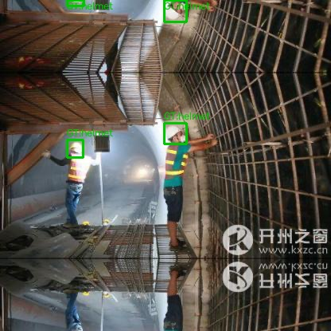

2. **强亮光/高亮区域容易误报。** 因为：夜间作业灯眩光（`FP1_hard_hat_workers1398`，
   在眩光处报出 FP:head 0.67）、镜面冰塔上的高亮白块（`FP2_hard_hat_workers2155`，
   FP:helmet 0.39/0.62）在形状和颜色上与浅色安全帽/头部相近，高亮块成了"伪目标"。

   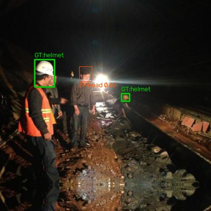

3. **极端模糊样本，连人工都无法判断。** 因为：`FP1_hard_hat_workers1636` 中白色块
   过于模糊，人眼都不能确定是亮光还是头盔，模型报 FP:helmet 0.52 属边界样本——
   这类错误的上限由图像质量决定，而非模型能力。

   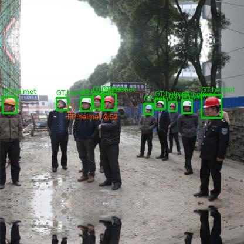

4. **同款橙色工作服密集重合时，模型难以判断"是否还有一个人"。** 因为：多名工人
   穿同色工作服贴身站立（`FP1_hard_hat_workers1863`、`FP2_hard_hat_workers1376`），
   大面积橙色块相连，模型在人群缝隙处多报 helmet（0.50/0.30）。
   （附带发现：这两张图边缘同样带有镜像特效痕迹，与第 1 条互为印证。）

   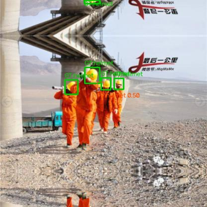

5. **零件颜色与肤色/旧安全帽色高度相似导致误判。** 因为：`FP3_hard_hat_workers1360`
   中钻机生锈的圆形零件在颜色和质感上接近人脸与旧安全帽，模型对零件报出
   FP:helmet 0.55 等 3 处误报。

   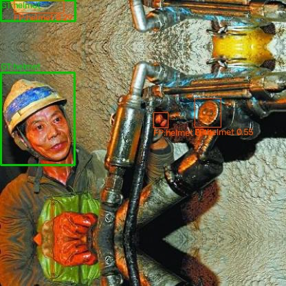

## 7. 失败记录

> 完整素材清单在 `logs/failure_facts.md`（共 7 条）。这里详写 3 条教训最深的，
> 其余 4 条略写备查。

### 详记①：后台训练的 worker 集体崩溃（Windows 你可以自己去面壁）

- **尝试**：把训练挂成后台独立进程，人负责睡觉，模型自己跑。
- **预期**：几小时后完成第二步训练安排。
- **实际**：没多久就崩了，`DataLoader worker exited unexpectedly`，训练直接中断。
- **排查**：Windows 下分离出来的后台进程没有控制台，DataLoader spawn 出的
  worker 子进程在这个环境里活不下来——不是代码 bug，是平台特性（哎这个windows怎么这么坏啊）。
- **解决**：`workers=0`，数据加载退回主进程串行做，代价是训练慢约 20~30%。
- **教训**：挂机方案本身也要先做冒烟测试；"能跑"和"能挂着跑"是两回事。

### 详记②：消融实验无声失效——optimizer=auto 静默忽略 lr0

- **尝试**：消融 B 想把 lr0 减半，验证学习率敏感性。
- **预期**：得到一个"lr 减半"的对照组。
- **实际**：跑完一看，结果和 base **逐位相同**——best_epoch 一样，mAP 四位小数全一样。
- **排查**：同 seed 下结果完全相同 → 怀疑配置根本没生效 → 翻训练日志发现一行
  `ignoring lr0 and determining best optimizer automatically`：optimizer=auto 会
  无视手动传入的 lr0/momentum，而且它实际选的是 AdamW，不是我以为的 SGD。
- **二次踩坑**：第一次修复时我改成显式 SGD+lr0=0.005，结果引入了"换优化器"这个
  第二变量，对照被污染；最终改成显式 AdamW + lr0=0.000714（正好是 auto 值的一半），
  才算干净的单变量。重跑后通过 epoch1 的 warmup lr 日志值确认配置真的生效了。
  无效行没有删，在 results.tsv 里标了 INVALID 留痕。
- **教训**：框架的"智能默认"会静默覆盖用户意图；**消融实验必须先验证变量真的变了**，
  否则跑一晚上只是在给同一个实验换个名字。

### 详记③：美丽校园网依旧美美肘击Kaggle下载

- **尝试**：直接下单连接下载 1.3GB 数据包。
- **实际**：0.03 MB/s，照这速度项目窗口期全耗在下载上。换 8 线程 Range 并行下载，
  冲到 2 MB/s 又被校园网 QoS 压回去。
- **解决**：重启进程换新连接 + 分块断点续传。附带修了个自己的 bug：续传后进度
  计数器只算本次新增字节，误报"下载不完整"，改成按每个分块的实际字节数校验。
- **教训**：环境限制也是项目的一部分；校验逻辑要校验"事实"（文件多大），
  不能校验"自己的计数器"。

### 略记（其余 4 条）

| # | 尝试 | 实际 | 解决 |
|---|---|---|---|
| 3 | AMP 混合精度训练 | AMP 校验要联网下载 yolo26n.pt，校园网间歇超时，自动退回 FP32，显存翻倍 | 趁网络通的时候手动 curl 下好权重，后续校验直接过 |
| 4 | 指定输出目录 `runs/detect` | 相对路径被拼成 `runs/detect/runs/detect/<name>` 嵌套两遍 | 改传绝对路径 `Path.cwd()/runs/detect` |
| 5 | `git add -A` 提交代码 | 把 1.3GB 数据集上万个文件全 stage 了，卡死超时 | 清索引锁 + .gitignore 排除 data/runs/weights，仓库最终只含代码文件 |
| 6 | 数据分析 | person 类仅 751 实例且社区公认标注不全；helmet:person ≈ 25:1；68.8% 的框小于图像 1% | 写进难点与局限，person 的低 AP 归因标注质量而非模型能力 |

## 7.5 学习路径与认知递进（学习记录）

> 本节按认知层次而非时间顺序整理项目中的真实疑问。四层的递进本身就是学习成效的证明：
> 先让东西跑起来（工程），再学会判断好坏（诊断），再学会高效改进（方法），最后理解为什么（原理）。#说白了就是想到啥问啥，驱动问题部分就是我诚实提问的内容

### 第一层：工程层 —— "怎么让流程跑通"

- 驱动问题：数据集选哪个？格式怎么转？训练怎么挂机不中断？终端里跑的是 REPL 还是脚本？
- 收获：VOC→YOLO 转换与类别映射、固定 seed 划分防泄漏、训练进程与交互会话解耦、
  后台训练 + 日志轮询的工作模式
- 关于代码执行形态的辨析：REPL（逐行交互、状态累积）、断点调试（完整程序截停观察）、
  脚本批处理（无人值守跑到底）是三种形态；长训练属于批处理——交互归人（写代码、调试、
  看结果），批处理归机器（训练）。所有脚本做成 `--config` 参数驱动正是为了去掉中途人工输入
- 代价换来的经验：校园网限速下用多线程 Range 断点续传；Windows 后台进程必须 workers=0
  （详见失败记录）

### 第二层：诊断层 —— "怎么知道模型状态好不好"

- 驱动问题："怎么确认有没有过拟合？""学习率怎么才算合适？"
- 收获：过拟合判定需要 val loss 拐点 + mAP 平台期**双证据**，再以 best.pt 做 train/val 对比定量
  （差距 >10 点才算真过拟合）；检测任务因训练集有增强，val loss 低于 train loss 属正常，
  判过拟合看走势分化而非绝对高低
- 关键转变：从"看一个数"升级为"看一组相互印证的证据"

### 第三层：方法层 —— "怎么科学地迭代"

- 驱动问题："调试总不能手调梯度和偏导吧？""每次优化都重训一遍岂不是很慢？"
- 收获：① 实践调的是四类旋钮——数据/优化超参/模型容量与输入分辨率/后处理阈值
  （后者零训练成本）；② 消融实验纪律：一次只变一个变量，每轮实验先写明"要回答什么问题"；
  ③ 成本控制：200 张×10 epoch 探针先验证方向（5~10 分钟），方向对才上全量，
  patience 早停自动止损
- 关键转变：从"盲目试错"升级为"诊断驱动的假设验证循环"

### 第四层：原理层 —— "为什么这样设计"

- 驱动问题："模型的 CNN 架构、卷积核、参数量是什么样的？""损失函数和激活函数用了什么？"
  "SGD 和 Adam 有何优劣，这里适配有何区别？""训练的产物为什么不是代码？"
- 收获（全部基于对实际权重的实测，非文档转述）：YOLOv8n 共 3,157,200 参数
  （backbone 40%/neck 31%/head 28%），64 层卷积（39×3×3+25×1×1），SiLU 激活；
  损失 = CIoU（重叠+中心距+宽高比）+ DFL（框边距离的概率分布预测）+ BCE 三项分工；
  优化器 auto 规则自动选择 AdamW(lr=0.001429, beta1=0.9)——并且它会静默忽略手动传入的
  lr0/momentum（消融 B 因此返工，见失败记录第 7 条），亲身体会"框架智能默认可能覆盖用户意图"
- 关键概念澄清：**模型 = 架构（代码定义的空架子）+ 权重（训练填进去的数字）**。
  训练的产物不是代码而是 best.pt——那 316 万个被反向传播更新过的数字就是模型本体；
  代码定义模型长什么样，训练决定模型会做什么，数据决定它做得多好

对 best.pt 做特征图可视化（`scripts/feature_maps.py`），CNN 的"所见"直观可见：

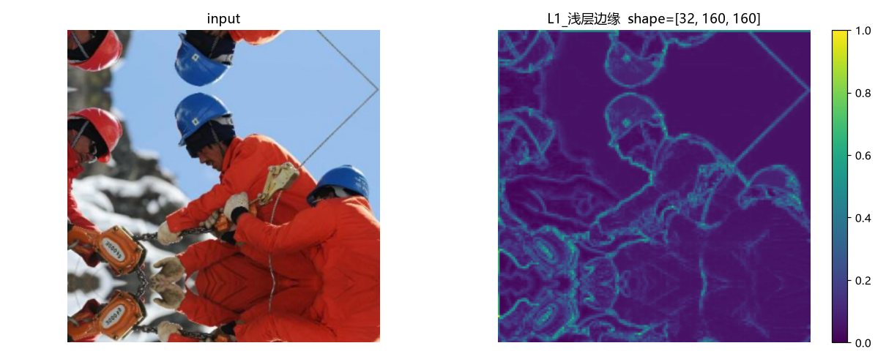

*图 6：浅层 L1（shape 32×160×160）——整张图变成"描边画"，与教科书边缘检测算子一致。*

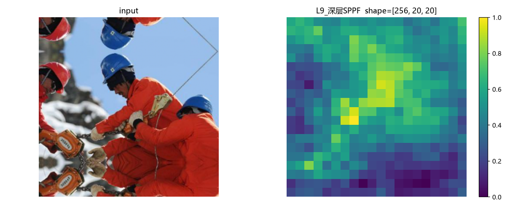

*图 7：深层 L9（shape 256×20×20）——640×640 的图被逐级压缩成 20×20 的"理解"，
亮区即"人大概在哪"，检测头就在这上面数框。*
- 关键转变：从"会用 API"升级为"能解释每个设计决策的动机"

### 延伸疑问：NPU 为什么全程闲置

- 背景：采购电脑前就了解到 Intel Ultra 系列处理器搭载了面向神经网络的 NPU，
  但实际跑模型时任务管理器里 NPU 占用恒为 0%，这个元件的日常用途似乎只有省电，一度感到困惑。
- 澄清：NPU 是**低功耗推理**专用电路（INT8 量化前向计算，服务于视频会议特效等常开场景），
  既无 FP32 精度也不支持反向传播，训练只能走 CUDA → GPU。厂商宣传的"为 AI 设计"指的是推理端。
- 对应的下一步计划：将 best.pt 导出 ONNX → OpenVINO 量化 INT8 → 部署到 NPU 做实时检测，
  那才是它的用武之地（详见第 8 节）。

## 8. 局限与未覆盖项（诚实交代）

因 28 小时交付窗口，以下项目主动放弃并在评审时如实说明：

- 未做 OOD（跨域）独立测试集评估
- 未做 ONNX 导出与部署一致性校验（接口已预留）
- 消融完成 3 组（mosaic / lr / imgsz），weight_decay 维度未覆盖
- 100 epoch 加长实验已做（早停于第 66 轮），但 cosine 衰减未走完全程，
  "零收益"结论存在理论上的小尾巴（详见第 4 节）
- 错误分析样本量 60 张（conf=0.25，原计划 100 张）

### 下一步计划

- ONNX 导出 + OpenVINO INT8 量化，部署到处理器 NPU 做实时推理（让闲置的 NPU 上岗）
- 追加 weight_decay 消融，补全消融矩阵
- 数据侧改进（第 4 节修订对策）：清洗网抓镜像杂质图、copy-paste 增强、修 person 标注
- 自采 300~500 张本地工地/俯拍图像做完全独立的 OOD 测试集

## 9. 复现

```bash
# 解释器: torch314 conda 环境（torch 2.14.0+cu130, ultralytics 8.4.155）
python scripts/convert_voc_to_yolo.py --raw data/raw --out data/yolo
python scripts/check_data.py
python scripts/visualize_annotations.py --n 50

# 训练（Windows 后台运行需 workers=0）
python scripts/train.py --config configs/base.yaml
python scripts/train.py --config configs/ablation_no_mosaic.yaml
python scripts/train.py --config configs/ablation_lr_half.yaml
python scripts/train.py --config configs/ablation_imgsz960.yaml
python scripts/train.py --config configs/base_long100.yaml    # 100 epoch 加长验证

# 诊断 / 错误分析 / 演示
python scripts/analyze.py --run runs/detect/base        # 每组实验各跑一次
python scripts/gen_badcases.py --run runs/detect/base    # 生成 badcases/ 分类图
python scripts/demo_predict.py                           # 测试集评估 + 预测叠加图
python scripts/feature_maps.py --img <图片路径>          # CNN 各层特征图可视化
```

环境版本与种子：seed=42，requirements.txt 锁定。

## 10. 后记

这个项目 2026-10-08 晚上开工，2026-10-09 傍晚收工，墙钟约 22 小时——人，你去睡觉；机，你去把课题打败（

这里有我自己的考虑，兑。早交的选手里常见的翻车是：数据集只取一小撮，训练集上接近满分，基本百分百过拟合。为了不掉进这个坑，我把时间花在了几件"看不到产出"的事上：

- 坚持用全量 5000 张，不图快切子集；划分用固定 seed，杜绝数据泄漏；
- 开训前先花一晚做数据体检和 50 张标注人工抽检——宁可慢，不能瞎；
- 每组实验只动一个变量，先写明"要回答什么问题"再开跑，跑完拿 train/val 差距定量查过拟合，不凭感觉下结论；
- 哪怕时间紧，最后也挤出一次 100 epoch 加长跑去验证"是不是没训够"——假设被推翻了，但排除错误假设本身就是收获。

机器学习时我的老师提醒过我，数据的质量远比数量重要的多，并且数据不等于真实世界，这也让我想起了维特根斯坦的理论……
说到底，这次实践对我认知的帮助还是十分甚至九分的显著的，我会继续完善自己的技能，继续在这条路上走的更远
